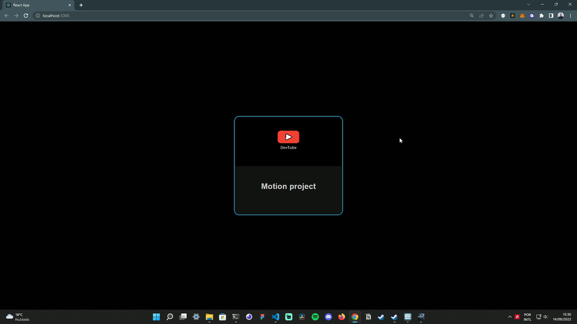

# Awesome Animated React Card

### A simple animated react card using framer-motion.

 
 

## Run the project
 
Git clone
<pre>
    git@github.com:martsDev/Awesome-Animated-React-Card.git
</pre>

 

Access project directory
<pre>
    cd Awesome-Animated-React-Card
</pre>

 

Run npm install
<pre>
    npm install
</pre>

 

Run the project
<pre>
    npm start
</pre>